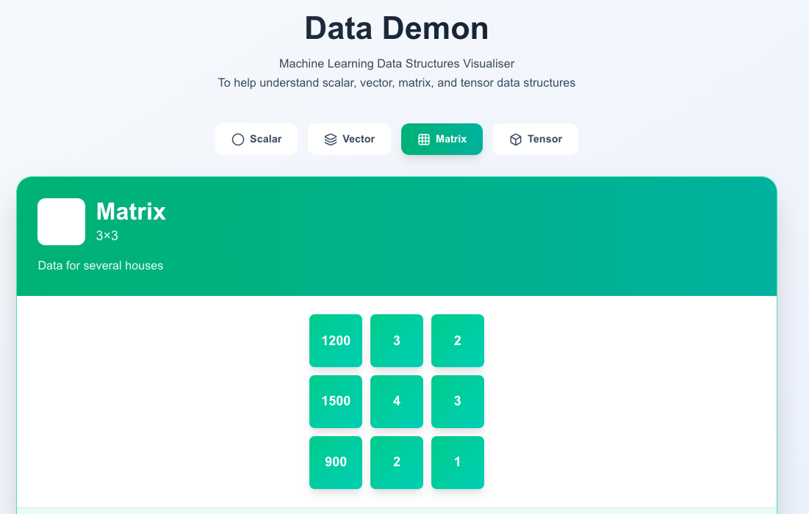

# Data Demon
## Machine Learning Data Structures Dimensions Visualiser

An interactive web application that helps you understand the fundamental data structures in machine learning and data science: scalars, vectors, matrices, and tensors.




## Features

- **Interactive Visualisation** - Click through different data types to see them come to life
- **Real-World Examples** - Each structure is explained with practical house pricing examples
- **Beautiful UI** - Modern, gradient-based design with smooth animations
- **Educational** - Perfect for students learning ML, data science, or linear algebra

## What You'll Learn

### Scalar (1×1)
A single number - the simplest data structure. Like a house price: £25k.

### Vector (1×3)
A one-dimensional array of numbers. Like features of a house: square footage, bedrooms, bathrooms.

### Matrix (3×3)
A two-dimensional grid of numbers. Like a dataset with multiple houses, where each row is a house and each column is a feature.

### Tensor (2×2×3)
Multi-dimensional data. Like multiple datasets of houses, or images with height × width × colour channels (RGB).

## Getting Started

### Prerequisites

- Node.js (v18 or higher)
- npm or yarn

### Installation

1. Clone the repository
```bash
git clone https://github.com/yourusername/data-dimensions-viz.git
cd data-dimensions-viz
```

2. Install dependencies
```bash
npm install
```

3. Run the development server
```bash
npm run dev
```

4. Open [http://localhost:3000](http://localhost:3000) in your browser

## Built With

- **Next.js 15** - React framework for production
- **React 19** - UI library
- **Tailwind CSS** - Utility-first CSS framework
- **Lucide React** - Beautiful icon library
- **JavaScript** - No TypeScript complexity

## Project Structure
```
next-lucide-app/
├── public/
│   └── images/
│       ├── logo.png
│       └── screenshot1.png
├── src/
│   └── app/
│       ├── DataDimensionsViz.js  # Main component
│       ├── page.js                # Home page
│       ├── globals.css            # Global styles
│       └── layout.js              # Root layout
├── package.json
└── README.md
```

## Customisation

### Change Colours
Edit the gradient colours in `DataDimensionsViz.js`:
```javascript
const types = {
  scalar: {
    color: 'from-purple-500 to-pink-500',  // Change these!
    // ...
  }
}
```

### Add New Data Types
Extend the `types` object in `DataDimensionsViz.js` to add more visualisations.

## Screenshots

The app features four interactive views:
- **Scalar** - Single value with a circular display
- **Vector** - Three columns showing house features
- **Matrix** - 3×3 grid of values
- **Tensor** - Layered 3D visualisation

## Contributing

Contributions are welcome! Feel free to:
1. Fork the project
2. Create your feature branch (`git checkout -b feature/AmazingFeature`)
3. Commit your changes (`git commit -m 'Add some AmazingFeature'`)
4. Push to the branch (`git push origin feature/AmazingFeature`)
5. Open a Pull Request

## Licence

This project is open source and available under the [MIT Licence](LICENSE).

## Author

**Tech Angel X**  
Created by Ricki Angel

## Acknowledgements

- Inspired by the need to make data science concepts more accessible
- Built for students, educators, and ML enthusiasts
- Icons by [Lucide](https://lucide.dev/)

## Links

- [Live Demo](#) - Add your deployment URL here
- [Report Bug](https://github.com/yourusername/data-dimensions-viz/issues)
- [Request Feature](https://github.com/yourusername/data-dimensions-viz/issues)

---

Star this repo if you find it helpful!
